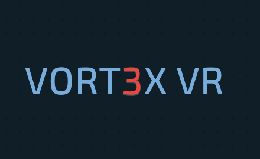

<!-- Improved compatibility of back to top link: See: https://github.com/othneildrew/Best-README-Template/pull/73 -->
<a name="readme-top"></a>

<!--

[![Contributors][contributors-shield]][contributors-url]
[![Forks][forks-shield]][forks-url]
[![Stargazers][stars-shield]][stars-url]
[![Issues][issues-shield]][issues-url]
[![MIT License][license-shield]][license-url]
[![LinkedIn][linkedin-shield]][linkedin-url]

-->


<!-- PROJECT LOGO -->
<br/>
<div align="center">

  <a href="https://github.com/OraclYT/vort3x-demo">
    
  </a> 


<h1 align="center">VORT3X ARENA DESK APP</h1>

  <p align="center">
     Desk app developed for a Game Arena to efficiently manage clients, payments, and device queues in gaming arenas with our user-friendly and secure website, ensuring a seamless gaming experience for all.
    <br/>
    <a href="https://github.com/OracleYT/vort3x-demo"><strong>Explore the docs »</strong></a>
    <br />
    <br />
    <a href="">View Demo Video</a>
    ·
     <!--
    <a href="https://github.com/github_username/repo_name/issues">Report Bug</a>
    ·
    <a href="https://github.com/github_username/repo_name/issues">Request Feature</a>
     -->
  </p>
</div>


<!-- ABOUT THE PROJECT -->
## About The Project

[![Mark-3 Screen Shot][product-screenshot]](https://youtu.be/zjhYZU-olpo)

[![Mark-3 Screen Shot 2][product-screenshot-2]](https://youtu.be/zjhYZU-olpo)

### Built With

* [![php][php.js]][Next-url]
* [![html][html.js]][Next-url]
* [![css][css.js]][Next-url]
* [![js][js.js]][Next-url]
<!--
* [![React][React.js]][React-url]
* [![Vue][Vue.js]][Vue-url]
* [![Angular][Angular.io]][Angular-url]
* [![Svelte][Svelte.dev]][Svelte-url]
* [![Laravel][Laravel.com]][Laravel-url]
* [![Bootstrap][Bootstrap.com]][Bootstrap-url]
* [![JQuery][JQuery.com]][JQuery-url]
-->


<!-- GETTING STARTED -->
## Getting Started

The Game Arena Web Desk is a comprehensive web application developed to revolutionize the management of gaming arenas. This user-friendly and secure website aims to efficiently handle clients, payments, and device queues, ensuring a seamless gaming experience for all patrons. By leveraging the power of HTML, PHP, CSS, and JS, the Game Arena Web Desk becomes a reliable tool for gaming zone operators to optimize operations and provide real-time insights to enhance customer satisfaction.

### Features
1. `Client Management`:
   
- **Register new clients**, collect essential details, and maintain a centralized database for easy access.
- View **client history**, track visit frequency.
  
2. `Payment System`:

- Facilitate seamless and **payments** for gaming sessions, memberships, and additional services.
- Generate automated **record** of transactions, enhancing transparency and accountability.

3. `Device Queues and Scheduling`:

- Implement an efficient **queue management system** for gaming devices to minimize waiting times.
- Allow clients to **pre-book gaming sessions** through the **website**, optimizing resource utilization.
- Provide **real-time updates** on device **availability** and **waiting times** to enhance customer satisfaction.

4. `Analytics and Reporting`:

- Track and analyze key **performance indicators**, such as average waiting time, peak hours, and revenue trends.
- Generate comprehensive reports and visualizations to gain valuable insights for business decision-making.

5. `User-Friendly Interface`:

- Design an **intuitive** and **responsive user** interface for easy navigation and interaction with the web app.
   
<!--
### Installation

1. Get a free API Key at [https://example.com](https://example.com)
2. Clone the repo
   ```sh
   git clone https://github.com/github_username/repo_name.git
   ```
3. Install NPM packages
   ```sh
   npm install
   ```
4. Enter your API in `config.js`
   ```js
   const API_KEY = 'ENTER YOUR API';
   ```
-->


## Tech Stack

Front-end: **HTML**, **CSS**, **JavaScript** (JS) <br>
Back-end: **PHP** <br>
Database: **MySQL** or any other preferred relational database management system <br>


<!-- Target audience -->
## Target Audience

The Game Arena Web Desk is tailored for gaming arena owners, managers, and staff responsible for managing day-to-day operations, customer interactions, and payment processing. It can be deployed in both small gaming lounges and large-scale gaming arenas to enhance efficiency and elevate the overall gaming experience for clients.

The Game Arena Web Desk aims to become an indispensable tool for gaming arena management, promoting customer loyalty and driving business growth while maintaining a secure and user-friendly environment for both staff and clients.

<!-- CONTACT -->
## Contact

Bhargav Singh Barad - [@linkedin](https://www.linkedin.com/in/bhargav-singh-barad/) - bhargavsinghbarad007@gmail.com

Project Demo Link: [Video Demo](https://youtube.com/playlist?list=PLpSi8Gwi0z9nyUyJVV74FNBRccZhwmUbg)


### !NO SOURCE CODE(CAN BE USED BY OTHERS IF DECLARED)


<p align="right">(<a href="#readme-top">back to top</a>)</p>


<!-- MARKDOWN LINKS & IMAGES -->
<!-- https://www.markdownguide.org/basic-syntax/#reference-style-links -->
[contributors-shield]: https://img.shields.io/github/contributors/github_username/repo_name.svg?style=for-the-badge
[contributors-url]: https://github.com/github_username/repo_name/graphs/contributors
[forks-shield]: https://img.shields.io/github/forks/github_username/repo_name.svg?style=for-the-badge
[forks-url]: https://github.com/github_username/repo_name/network/members
[stars-shield]: https://img.shields.io/github/stars/github_username/repo_name.svg?style=for-the-badge
[stars-url]: https://github.com/github_username/repo_name/stargazers
[issues-shield]: https://img.shields.io/github/issues/github_username/repo_name.svg?style=for-the-badge
[issues-url]: https://github.com/github_username/repo_name/issues
[license-shield]: https://img.shields.io/github/license/github_username/repo_name.svg?style=for-the-badge
[license-url]: https://github.com/github_username/repo_name/blob/master/LICENSE.txt
[linkedin-shield]: https://img.shields.io/badge/-LinkedIn-black.svg?style=for-the-badge&logo=linkedin&colorB=555
[linkedin-url]: https://linkedin.com/in/linkedin_username
[product-screenshot]: images/ss1.png
[product-screenshot-2]: images/ss2.png
[php.js]: https://img.shields.io/badge/php-000000?style=for-the-badge&logo=php&logoColor=white
[Next-url]: https://nextjs.org/
[html.js]: https://img.shields.io/badge/html-20232A?style=for-the-badge&logo=html&logoColor=61DAFB
[css.js]: https://img.shields.io/badge/css-DD0031?style=for-the-badge&logo=css&logoColor=white
[React-url]: https://reactjs.org/
[Vue.js]: https://img.shields.io/badge/Vue.js-35495E?style=for-the-badge&logo=vuedotjs&logoColor=4FC08D
[js.js]: https://img.shields.io/badge/JavaScript-000000?style=for-the-badge&logo=javascript&logoColor=4FC08D
[Vue-url]: https://vuejs.org/
[Angular.io]: https://img.shields.io/badge/Angular-DD0031?style=for-the-badge&logo=angular&logoColor=white
[Angular-url]: https://angular.io/
[Svelte.dev]: https://img.shields.io/badge/Svelte-4A4A55?style=for-the-badge&logo=svelte&logoColor=FF3E00
[Svelte-url]: https://svelte.dev/
[Laravel.com]: https://img.shields.io/badge/Laravel-FF2D20?style=for-the-badge&logo=laravel&logoColor=white
[Laravel-url]: https://laravel.com
[Bootstrap.com]: https://img.shields.io/badge/Bootstrap-563D7C?style=for-the-badge&logo=bootstrap&logoColor=white
[Bootstrap-url]: https://getbootstrap.com
[JQuery.com]: https://img.shields.io/badge/jQuery-0769AD?style=for-the-badge&logo=jquery&logoColor=white
[JQuery-url]: https://jquery.com 
